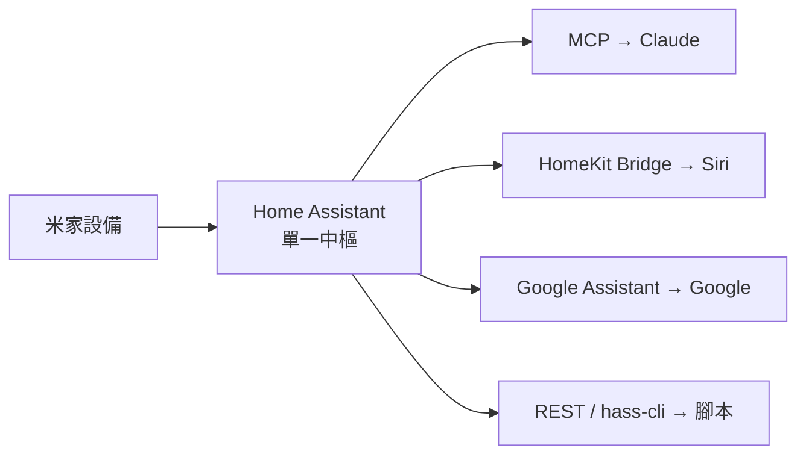

# Smart Home 米家整合筆記

把一整組**米家（Xiaomi Mijia）**設備，用 **CLI / MCP / Agent Skills** 控制，並與 **Apple Home（Siri）**、**Google Home**、**開源 HomeKit** 聯動的研究筆記。

## 先看結論：你的情況 → 推薦方案

| 你的情況 | 推薦方案 | 為什麼 |
|---|---|---|
| 有一整組設備、要 Siri + Google 全聯動、能養一台常駐機 | [**Home Assistant 中樞**](solutions/home-assistant.md) | 整合一次，MCP／Siri／Google 全部從它長出來 |
| 只想用 Claude／CLI 輕量控制，不想架整套 HA | [**MijiaPilot**](solutions/mijiapilot.md) | 一個專案 = CLI + MCP + HomeKit |
| 只有 1–2 台、臨時控制 | [**點對點橋接**](solutions/point-to-point.md) | `python-miio` + `homebridge-miot` + 原生 Google，最小成本 |

完整的[大比較矩陣與決策樹在這裡](solutions/index.md)。

## 推薦架構一眼看懂

別做 N 個點對點橋接——用一台 HA 當中樞，其他能力全部從它派生。

## 怎麼逛這份筆記

1. **[概念](concepts/local-vs-cloud.md)** — 先搞懂[本地 vs 雲端](concepts/local-vs-cloud.md)、[帳號分區](concepts/account-region.md)、[認證與 Token](concepts/auth-token.md)、[Matter](concepts/matter.md)。這些是貫穿全站的底層。
2. **[控制介面](control/cli.md)** — 你怎麼下指令：[CLI](control/cli.md)、[MCP 與 Agent Skills](control/mcp.md)。
3. **[生態聯動](ecosystem/apple-home.md)** — 接語音助理：[Apple/Siri](ecosystem/apple-home.md)、[Google](ecosystem/google-home.md)、[開源 HomeKit](ecosystem/open-source-homekit.md)。
4. **[方案比較](solutions/index.md)** — 把上面組成端到端架構，含大矩陣與決策樹。
5. **[參考](reference/devices.md)** — [我的裝置](reference/devices.md)清單與[連結彙整](reference/links.md)。

!!! tip "台灣使用者特別注意"
    小米帳號[分區](concepts/account-region.md)會影響 token、官方整合與 Google 綁定。動手前先確認你的帳號在哪一區。

## llms.txt

機器可讀索引：

- [`llms.txt`](https://daviddwlee84.github.io/SmartHome/llms.txt) — page-level index
- [`llms-full.txt`](https://daviddwlee84.github.io/SmartHome/llms-full.txt) — full content
