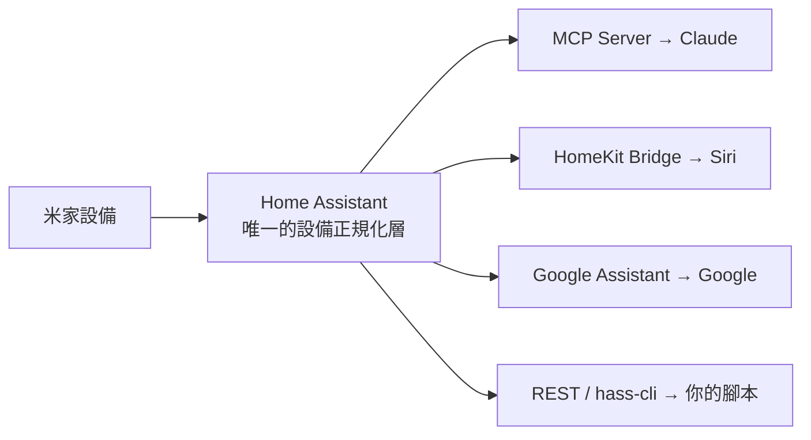

# Home Assistant 中樞（推薦）

如果你有**一整組**設備、又想要全生態聯動，最穩健的做法不是做 N 個點對點橋接，而是**架一台 Home Assistant（HA）當單一中樞**，其他能力全部從它長出來。

## 架構



## 接米家進 HA

| 整合 | 來源 | 連線 | 覆蓋 | 備註 |
|---|---|---|---|---|
| [`XiaoMi/ha_xiaomi_home`](https://github.com/XiaoMi/ha_xiaomi_home) | Xiaomi 官方 | 雲端為主，僅中央網關本地 | 廣（BLE/紅外/虛擬除外） | OAuth 登入；本地模式主要限中國區 |
| [`al-one/hass-xiaomi-miot`](https://github.com/al-one/hass-xiaomi-miot) | 社群 | 雲端／本地 | **最廣**、更新頻繁 | 常經 HACS 安裝 |
| [`AlexxIT/XiaomiGateway3`](https://github.com/AlexxIT/XiaomiGateway3) | 社群 | 本地閘道 | 走網關的老設備 | 打通本地控制 |

## 五步搭建

1. **接米家**：裝官方 `ha_xiaomi_home`（OAuth）或社群 `hass-xiaomi-miot`（覆蓋更廣）。老設備可加 `XiaomiGateway3` 走本地。
2. **Claude 控制**：開 HA 的 [Model Context Protocol Server 整合](https://www.home-assistant.io/integrations/mcp/)，把**所有**設備曝露給 Claude。
3. **Siri**：開 HA 的 **HomeKit Bridge** 整合。
4. **Google**：開 HA 的 **Google Assistant** 整合。
5. **CLI／Skill**：用 HA 的 REST/WebSocket API 或 `hass-cli`，讓你的 [Agent Skill](../control/mcp.md#agent-skills) 直接打它。

## 取捨

- **好處**：整合一次、下游全通；換品牌設備不用重接；全部 self-hosted／開源。
- **代價**：要養一台常駐機（樹莓派／NAS／小主機）。

!!! warning "台版帳號注意"
    官方整合的**完整本地控制**依賴 Xiaomi Central Hub Gateway，而它主要在中國大陸區。若你的帳號在新加坡等[非中國區](../concepts/account-region.md)，多數控制仍走雲端——功能可用，但別預期全本地。

---

## 雙區實戰：tw + cn 兩個 config entry

你的 fleet 橫跨 **tw（台灣）＋ cn（中國）兩個伺服器區**，這是選整合的**決定性因素**：

!!! danger "官方整合看不到 tw 區裝置"
    官方 `XiaoMi/ha_xiaomi_home` 的 OAuth 區域只有：中國大陸、歐洲、印度、俄羅斯、新加坡、美國——**沒有 tw**。若你的裝置真的在 tw 區，官方整合結構上就是瞎的。`al-one/hass-xiaomi-miot` 明確支援 `cn, de, i2, ru, sg, tw, us`（含 tw）。**所以這批 fleet 以 al-one 為主**，官方頂多當 cn 區的次要。

沒有整合能在**單一 entry** 裡合併多個伺服器。乾淨做法是**把 al-one 加兩次**：

| Entry | Server / Region | 涵蓋 |
|---|---|---|
| #1 | Taiwan (tw) | tw 家的裝置 |
| #2 | China (cn) | cn 家的裝置 |

1. 裝 HACS → 裝 **Xiaomi Miot Auto**（`al-one/hass-xiaomi-miot`）當主整合。
2. Settings → Devices & services → Add Integration → Xiaomi Miot Auto → 用米家帳號登入 → **Server/Region = Taiwan (tw)**，匯入 tw 家。
3. 再 Add Integration 一次 → 帳號 → **Server/Region = China (cn)**，匯入 cn 家。兩區以兩個 config entry 並存。

!!! tip "先確認每個家在哪一區"
    有些台灣使用者的裝置其實在 **sg**（新加坡）。用 `mi-tokens` 逐區抽一次（預設掃 `tw, sg, cn`）——裝置只會列在它真正所在的區。

## 本地控制與 stale-IP

al-one 有 Automatic / Local / Cloud 三種模式，`Local`/`Automatic` 對支援的 WiFi（miot-spec）裝置走 LAN 協定，直接吃**你已抽出的 token**：

```yaml
# configuration.yaml —— 對已加入的雲端裝置強制本地
xiaomi_miot:
  device_customizes:
    'fengmi.projector.m045j':
      miot_local: true
```

cloud IP 過期的裝置，用 config flow 的 **host/token** 加：填**即時 IP** + token + model。

!!! warning "stale-localip 只咬本地控制"
    雲端模式**不碰 LAN IP**（只打 `api.io.mi.com`）——所以投影機報 `26.26.26.1` 卻活在 `.189` 對雲端控制無影響，只在**本地控制**時咬你。解法：`mi-tokens verify` 自動 **ARP-by-MAC** 解即時 IP，或在路由器對該 MAC 做 **DHCP 靜態綁定**。

!!! danger "192.168.31.x 子網互撞"
    所有小米路由器都發 `192.168.31.x`，兩個家的子網會撞——**一台 HA 只能本地控它實體所在的那個 LAN**。槓桿由大到小：(1) 把其中一家的 LAN 改成 `192.168.30.0/24`；(2) 每台做 MAC → 固定 IP 的 DHCP 保留；(3) 想全本地就**一家一台 HA**。

> 更正：空調伴侶的 Zigbee 子裝置本地路徑是內建 `xiaomi_aqara`（`lumi.acpartner.v3` 支援、v2 官方不支援），**不是** `AlexxIT/XiaomiGateway3`——後者只支援多模網關（`ZNDMWG03LM` 等），你現有的 `lumi.acpartner.*` 用不到。投影機等非原生類別靠 al-one 的通用 host/token（miot-spec）。

## 接 Claude：HA 內建 MCP Server

裝置進 HA 後，用 HA **官方第一方**的 `Model Context Protocol Server` 整合曝露給 Claude Code——品牌無關、一個端點，不經 `api.mijia.tech` 第三方。

1. **加整合**：Settings → Devices & services → Add integration → **Model Context Protocol Server**。
2. **曝露給 Assist**：Settings → Voice assistants → 你的 Assist pipeline → **Expose** 分頁 → 選要給 agent 控的實體（可加別名如「客廳投影機」）。**MCP 只看得到曝露給 Assist 的實體**；門鎖/車庫等敏感裝置別曝露。
3. **建 token**：HA → 使用者 → Security → **Long-lived access tokens** → Create。
4. **在 Claude Code 註冊**（原生 HTTP，免 wrapper）：

```bash
claude mcp add --transport http --scope user home-assistant \
  https://<HA_URL>/api/mcp --header "Authorization: Bearer <LONG_LIVED_TOKEN>"
claude mcp list           # 確認 ✓ Connected
```

!!! note "端點路徑看 HA 版本"
    新版 HA = Streamable HTTP 在 `/api/mcp`；~2025.2 舊版 = SSE 在 `/mcp_server/sse`（那就用 `--transport sse`）。401 是 token/header 錯。Claude **Code** 不需 `mcp-proxy`（那是 Desktop 用的）。

!!! warning "IR 要先是 HA 實體才控得到"
    要讓 Claude 噴 IR，blaster/遙控必須先在 HA 是可控實體（`remote`/`switch`）並曝露給 Assist——見 [本地 IR 控制](../control/ir.md)。`miir.*` 虛擬遙控本身無法本地控，得先在本地重建。
