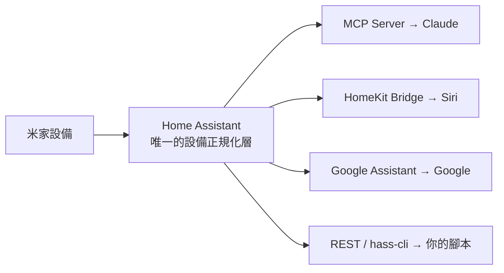

# Home Assistant 中樞（推薦）

如果你有**一整組**設備、又想要全生態聯動，最穩健的做法不是做 N 個點對點橋接，而是**架一台 Home Assistant（HA）當單一中樞**，其他能力全部從它長出來。

## 架構

## 接米家進 HA

| 整合 | 來源 | 連線 | 覆蓋 | 備註 |
|---|---|---|---|---|
| [`XiaoMi/ha_xiaomi_home`](https://github.com/XiaoMi/ha_xiaomi_home) | Xiaomi 官方 | 雲端為主，僅中央網關本地 | 廣（BLE/紅外/虛擬除外） | OAuth 登入；本地模式主要限中國區 |
| [`al-one/hass-xiaomi-miot`](https://github.com/al-one/hass-xiaomi-miot) | 社群 | 雲端／本地 | **最廣**、更新頻繁 | 常經 HACS 安裝 |
| [`AlexxIT/XiaomiGateway3`](https://github.com/AlexxIT/XiaomiGateway3) | 社群 | 本地閘道 | 走網關的老設備 | 打通本地控制 |

## 五步搭建

1. **接米家**：裝官方 `ha_xiaomi_home`（OAuth）或社群 `hass-xiaomi-miot`（覆蓋更廣）。老設備可加 `XiaomiGateway3` 走本地。
2. **Claude 控制**：開 HA 的 [Model Context Protocol Server 整合](https://www.home-assistant.io/integrations/mcp/)，把**所有**設備曝露給 Claude。
3. **Siri**：開 HA 的 **HomeKit Bridge** 整合。
4. **Google**：開 HA 的 **Google Assistant** 整合。
5. **CLI／Skill**：用 HA 的 REST/WebSocket API 或 `hass-cli`，讓你的 [Agent Skill](../control/mcp.md#agent-skills) 直接打它。

## 取捨

- **好處**：整合一次、下游全通；換品牌設備不用重接；全部 self-hosted／開源。
- **代價**：要養一台常駐機（樹莓派／NAS／小主機）。

!!! warning "台版帳號注意"
    官方整合的**完整本地控制**依賴 Xiaomi Central Hub Gateway，而它主要在中國大陸區。若你的帳號在新加坡等[非中國區](../concepts/account-region.md)，多數控制仍走雲端——功能可用，但別預期全本地。
