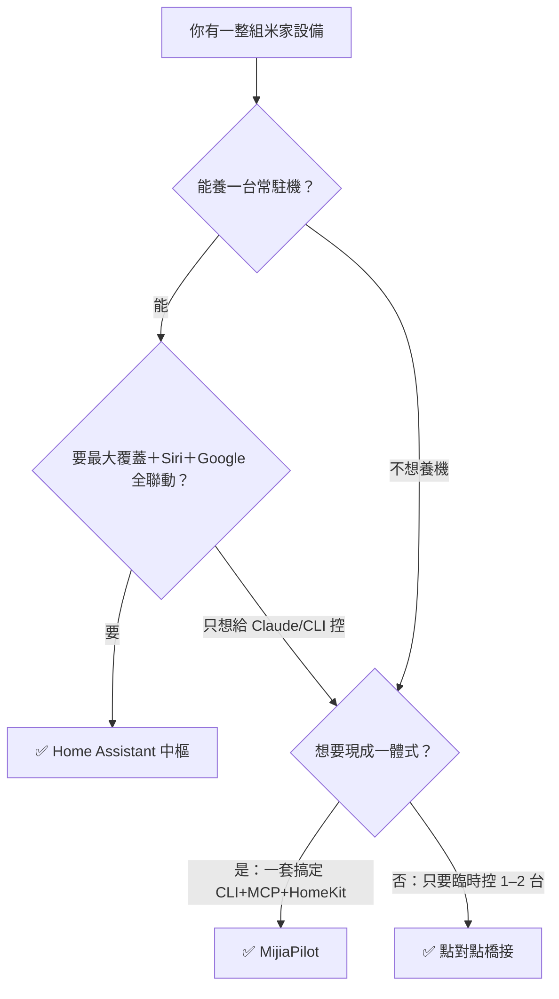

# 方案比較

這是整個筆記的核心。三種端到端架構——**Home Assistant 中樞**、**MijiaPilot 一體式**、**點對點橋接**——各有取捨。先看大比較矩陣與決策樹，再點進各方案頁看細節。

!!! info "怎麼讀這份筆記"
    **控制介面**與**生態聯動**頁講的是「單一能力」（某個 CLI、某個 MCP、某種 Siri 橋接）。**這裡的方案頁**講的是「端到端架構」——把那些能力組起來的完整方案。方案頁只會連進能力頁，不重複細節。

## 大比較矩陣

| 方案 | 本地/雲端 | 認證 | 裝置覆蓋 | 常駐主機 | CLI | MCP | Siri | Google | 穩健／維護 | 適合誰 |
|---|---|---|---|---|---|---|---|---|---|---|
| [**Home Assistant 中樞**](home-assistant.md) | 雲端為主，中央網關可本地 | OAuth | ★★★ 最廣 | 需要 | ✅ REST/`hass-cli` | ✅ 內建 MCP | ✅ HomeKit Bridge | ✅ Google Assistant | ★★★ 高／要養機 | 一整組設備、要全生態聯動、能養常駐機 |
| [**MijiaPilot**](mijiapilot.md) | 雲端 | QR | ★★ 廣 | 選用 | ✅ | ✅ 內建 | ✅ HAP-python | 走官方綁定 | ★★ 中 | 想要一套 CLI+MCP+HomeKit、輕量、給 Claude 用 |
| [**點對點橋接**](point-to-point.md) | 混合 | token + QR | ★ 依工具 | 不需要 | ✅ `python-miio` | 選用 | ✅ `homebridge-miot` | 官方綁定 | ★ 低／逐台手接 | 只有 1–2 台、臨時、不想架東西 |

## 決策樹

## 一句話結論

- **能養機、要完整** → [Home Assistant](home-assistant.md)。整合一次，MCP／Siri／Google 全部從它長出來。
- **要輕量、給 Claude 用** → [MijiaPilot](mijiapilot.md)。一個專案給你 CLI + MCP + HomeKit。
- **只有幾台、臨時** → [點對點](point-to-point.md)。`python-miio` + `homebridge-miot` + 原生 Google。

> 覆蓋率、穩健度、隱私、延遲的底層差異，都回到[本地 vs 雲端](../concepts/local-vs-cloud.md)這條軸；台版帳號還要注意[分區](../concepts/account-region.md)。
